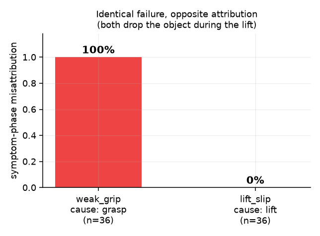
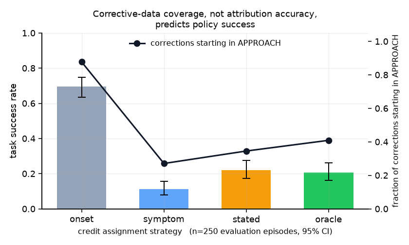
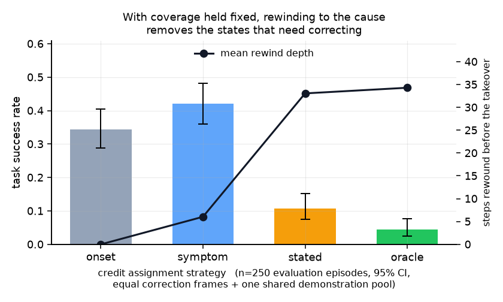

# Interactive correction for manipulation

<p align="center">
  
</p>

A Franka Panda in MuJoCo, a supervisor who intervenes when it goes wrong, and a
measurement of something that interactive imitation learning normally assumes
away:

> **When a human intervenes at step 3 of a multi-step task, was the error
> actually at step 1 — and what does getting that wrong cost the trained policy?**

Standard human-gated DAgger relabels from the moment the human takes the
controls. That is correct only when the mistake *is* where they took over. A
grasp misaligned during **approach** looks fine until the object slips during
**lift**; credit the correction to the lift and the cause is never fixed.

This repository measures how often that happens, and what it costs.

---

## Results

Measured in this repository, reproducible with `make study`. **The supervisor is
simulated** — see [Honest limitations](#honest-limitations).

**Misattribution depends on when the failure becomes *visible*, not on when it was
caused.** Rate at which the phase a failure appears in differs from the phase
that caused it:

| fault | cause → symptom | misattributed | detection lag |
|---|---|---|---|
| `lift_slip` | lift → lift | **0.0%** | 9.9 steps |
| `weak_grip` | grasp → lift | **100.0%** | 23.7 steps |

<p align="center">
  
</p>

These two produce *visually identical* failures — the object falls out during
the lift. Only the true cause differs, so the gap cannot be explained by the
failures looking different. n=36 each.

Across all six fault types, grouped by how far the symptom is from the cause
(n=280 episodes, supervisor tracing accuracy 0.35):

| lag class | n | onset | **symptom** | stated | detection lag |
|---|---|---|---|---|---|
| immediate | 74 | 1.000 | **0.000** | 0.000 | 9.8 |
| short | 39 | 0.872 | **0.667** | 0.359 | 33.7 |
| delayed | 75 | 0.813 | **0.893** | 0.507 | 48.2 |
| very delayed | 37 | 0.000 | **0.000** | 0.000 | 48.4 |

Asking the supervisor to name a cause roughly halves the error on delayed faults
(0.893 → 0.507) but does not remove it.

**An unplanned finding.** `wrong_object` (the robot picks the blue block instead
of the red one) has the largest gap between cause and consequence and was
predicted to be the worst case. It is attributed **perfectly — 0.000 across all
three measures** — because picking the wrong block is visible immediately, even
though its consequence only materialises three phases later. *The delay that
drives misattribution is observational, not causal.* The "very delayed" row
above is that finding: a category defined by causal distance that behaves
exactly like the immediate one.

**Whether that costs anything** is measured separately, and the answer is the
most interesting thing here: acting on a *correct* attribution made the policy
**worse**. Rewinding to the true cause scored 4.4% against 34.4% for not
rewinding at all, because restoring to the pre-failure state means the corrective
demonstration never enters the state the failure produced — so the dataset ends
up containing no supervision for it. See
[Result 3](#result-3-with-coverage-held-fixed-rewinding-to-the-cause-is-the-worst-thing-to-do).

**Supporting numbers**

| quantity | value |
|---|---|
| scripted expert baseline | 100/100 episodes |
| IK accuracy over 200 workspace poses | 200/200 converged, max error 0.2 mm |
| fault detection by the supervisor | 90–97% per fault type |
| episodes rescued by correction | 0% → 53–95% depending on fault |
| unnecessary interventions on 40 healthy episodes | **0** |
| study size | 280 episodes, 37,611 steps |

---

## What is actually built

```
scene + IK ──► scripted expert ──► fault injection ──► supervisor ──► recorder
   100%           100/100           6 fault types      detects 20/20    ↓
                                                                   corrections
                                                                        ↓
                        evaluation ◄── BC policy ◄── rewind + credit assignment
```

* **Environment** — Franka Panda, RGB-D cameras (wrist + scene), four labelled
  phases, and *bit-exact* state snapshot/restore.
* **Scripted expert** — 100% success. Not the deliverable; the instrument.
* **Fault injection** — six faults with known root-cause phase, spanning
  immediate to very delayed consequences.
* **Synthetic supervisor** — detects failures from observable state only, with a
  reaction delay and a tunable ability to trace causes.
* **interventionkit** — the recording and analysis layer, extracted as a
  [standalone package](interventionkit/) with numpy as its only dependency.
* **Rewind-and-redemonstrate DAgger** — the mechanism that turns a stated
  attribution into training data.
* **Behaviour cloning** — action chunking, spatial-softmax visual encoders,
  optional language conditioning.
* **VR teleoperation** — clutched relative control over a UDP protocol, so the
  headset runs in its own process on its own machine.

---

## Quick start

**Requires Python 3.10–3.13.** MuJoCo publishes no wheel for 3.14 yet, so pip
would try to build it from source and fail. `make` picks a suitable interpreter
automatically if one is installed.

```bash
git clone https://github.com/abyyworld/Interactive-correction-for-manipulation
cd Interactive-correction-for-manipulation
make install      # venv + project. numpy, mujoco, pytest. That is all.
make assets       # Panda meshes, pinned commit, ~33 MB
make test         # 73 tests
make study        # the attribution study + an HTML report
```

That is the whole minimum setup: **no GPU, no PyTorch, no plotting libraries**.
The attribution study renders no pixels, so it runs on a laptop in a few
minutes.

Add the optional pieces only when you need them:

```bash
make viz          # matplotlib + imageio, for figures and GIFs
make torch-cpu    # policy training on CPU (small download)
make torch-cuda   # policy training on NVIDIA (~2.5 GB, do this on wifi)
```

Then the learning half:

```bash
make demos EPISODES=800
make train
make eval
```

Run `make help` for everything else.

---

<p align="center">
  <br>
  
</p>

Full experimental design, including the controls and what it cannot tell you:
**[docs/study-design.md](docs/study-design.md)**.

## The experiment

### Measuring attribution

Errors are **injected deliberately** at a known phase, because on organically
failing rollouts nobody knows the true cause — that is the thing under study.

| fault | cause | symptom | lag |
|---|---|---|---|
| `grasp_offset` | approach | lift | delayed |
| `wrong_object` | approach | place | very delayed |
| `weak_grip` | grasp | lift | delayed |
| `premature_close` | approach | grasp | short |
| `lift_slip` | lift | lift | immediate |
| `early_release` | place | place | immediate |

The last two are controls. If misattribution were an artefact of the
measurement, they would be misattributed as often as the delayed ones.

Three attributions are recorded separately, and keeping them apart matters:

- **onset** — the phase at takeover. What HG-DAgger credits today.
- **symptom** — the phase where the failure became visible. The best a
  timestamp-based scheme can do.
- **stated** — what the supervisor says caused it. The only one that can point
  backwards past the symptom.

Measured by onset alone the result is *backwards* — immediate faults appear
100% misattributed and delayed ones 77%. The reason is that after a dropped
object the phase tracker correctly reverts to `approach`, so for approach-caused
faults the takeover phase accidentally matches. By symptom phase the picture
inverts and makes sense.

### Measuring the cost

When the supervisor names a phase, the episode is **rewound** to the start of it
using an exact state snapshot, and the correction is demonstrated from there.
Only the rewind target differs between conditions:

| strategy | rewinds to | |
|---|---|---|
| `onset` | the takeover step | today's HG-DAgger |
| `symptom` | where the failure became visible | timestamp ceiling |
| `stated` | the phase the supervisor blamed | what asking buys you |
| `oracle` | the true cause | not implementable; the ceiling |

Rewinding further necessarily yields *more* corrective frames — and not in the
obvious direction: `onset` yields the most, because recovering from a failure
takes longer than doing the task correctly. Every dataset is subsampled to the
size of the smallest (10,558 frames), so "corrected the right states" is
separated from "had more data".

### Result 2: perfect attribution bought nothing, and coverage was the reason

The prediction was that rewinding to the true cause (`oracle`) would beat
rewinding to the phase the supervisor blamed (`stated`), because only the former
reliably corrects the states that caused the failure. It did not.

<p align="center">
  
</p>

| strategy | rewinds to | corrections starting in `approach` | policy success (n=250) |
|---|---|---|---|
| `onset` | takeover step | **87.8%** | **69.6%** [63.6, 75.0] |
| `stated` | blamed phase | 34.6% | 22.0% [17.3, 27.5] |
| `oracle` | true cause | 41.0% | 20.8% [16.2, 26.3] |
| `symptom` | first visible | 27.1% | 11.2% [7.9, 15.7] |

**`stated` vs `oracle`: +1.2 points, confidence intervals overlapping.** Giving
the system perfect knowledge of the true cause did not measurably beat a
supervisor who was right 83% of the time.

But the ranking tracks the third column, not the second. Every evaluation
episode begins in `approach`. By the time the supervisor has reacted, the
dropped object has settled and the phase tracker has returned to `approach` — so
the naive rewind happens to produce corrections that start where the policy is
launched from. The strategies were not being compared on credit assignment at
all. They were being compared on how much of the task their corrective data
happened to cover.

That is a confound, not a finding. So the experiment was re-run with it removed.

### Result 3: with coverage held fixed, rewinding to the cause is the *worst* thing to do

Every condition now trains on **one shared pool of 150 clean demonstrations**
(11,132 frames), collected once and reused verbatim, plus its own corrections
subsampled to a common budget of 10,558 frames. Initial-state coverage is
therefore identical by construction, and the only remaining difference is where
the corrections sit.

```bash
make degradation-controlled
```

The raw report for every number below is committed in [`results/`](results/), so
the claims can be checked without a rerun.

<p align="center">
  
</p>

| strategy | rewinds to | mean rewind depth | policy success (n=250) |
|---|---|---|---|
| `symptom` | first visible | 6.0 steps | **42.0%** [36.0, 48.2] |
| `onset` | takeover step | 0.0 steps | 34.4% [28.8, 40.5] |
| `stated` | blamed phase | 33.1 steps | 10.8% [7.5, 15.3] |
| `oracle` | true cause | 34.3 steps | 4.4% [2.5, 7.7] |

The ordering inverts. `symptom` goes from worst to best; `oracle` goes from
mid-table to last, and is now the **worst strategy of the four** — beaten by
`stated`, its own noisy approximation, by 6.4 points (*p* = 0.007).

| comparison | difference | *p* |
|---|---|---|
| `symptom` vs `onset` | +7.6 | 0.08 |
| `onset` vs `stated` | +23.6 | 2.8 × 10⁻¹⁰ |
| `onset` vs `oracle` | +30.0 | 2.2 × 10⁻¹⁷ |
| `stated` vs `oracle` | +6.4 | 0.007 |

**Why.** The rewind is a state restore, so the corrective expert takes control at
the rewind point and drives from there. Rewind 34 steps — back to the moment the
fault was injected — and the arm is still in a state that looks healthy. The
expert flies a clean trajectory from it, and the episode simply never enters the
state the failure would have produced. The dataset ends up with **no supervision
for the failure at all**. Rewind to the takeover instead and the very first frame
of the correction *is* the failure state.

Correcting the cause deletes the evidence. That is the tension this project
found: causal correctness and on-policy coverage pull against each other, and
under behaviour cloning, coverage wins decisively.

**Two obvious proxies for correction quality both point the wrong way**, which is
the part worth remembering:

| strategy | corrections that succeed | best val loss | policy success |
|---|---|---|---|
| `symptom` | 84.5% | 0.0878 | **42.0%** |
| `onset` | 86.0% | 0.1013 | 34.4% |
| `stated` | 88.0% | 0.0895 | 10.8% |
| `oracle` | **91.5%** | **0.0874** | **4.4%** |

`oracle` produces the cleanest corrections and the lowest validation loss, and
the worst policy. Held-out loss is computed on the corrective data's own
distribution; the policy is evaluated on the distribution it induces itself.
Ranking strategies by either proxy would have inverted the answer.

`symptom` versus `onset` is not resolved (*p* = 0.08). Rewinding a few steps
before the takeover is plausibly the sweet spot — far enough back to catch the
failure as it forms, not so far as to skip past it — but this experiment cannot
say so.

**What this means for the original question.** Misattribution does cost
something, but not through the channel the hypothesis proposed. The supervisor
being wrong about *which phase* is a second-order effect. What dominates is that
acting on any attribution at all — right or wrong — moves the correction away
from the states that need it. The interesting protocol is not "attribute better";
it is "attribute for analysis, correct at the symptom."

---

## Honest limitations

Stated plainly, because the difference matters:

1. **The supervisor is simulated, not human.** `trace_accuracy` is a free
   parameter, not a measurement. The deliverable is the *curve* across it, so
   that when a VR study with real participants provides a number, the
   corresponding cost can be read off. No result here is a human result.
2. **The agent under supervision is a scripted expert with an injected fault**,
   standing in for a policy with a systematic error, because its failure mode is
   known exactly. A learned policy fails in messier ways.
3. **Behaviour cloning alone does not solve this task**, at 200 or 800
   demonstrations. Not for lack of fit: the policy predicts the expert's action
   to 0.052 mean L1, better than a 1-nearest-neighbour bound of 0.116. The
   failure is distribution shift, and it is measurable directly:

   | states the error is measured on | mean action L1 |
   |---|---|
   | states the **expert** visits (the training distribution) | **0.052** |
   | states the **policy** visits when driving | **0.239** (4.6×) |

   A policy that fits its training data well and is 4.6× worse wherever it
   actually goes is the textbook case for interactive correction — which is what
   this project is about — but it does mean the absolute policy numbers here are
   weak, and they are reported as such rather than tuned until they look good.
4. **Simulation only.** No real robot, no sim-to-real claim.
5. **Language conditioning is templated**, not free-form.
6. **The rewind protocol is one of several possible ones.** Every conclusion
   about credit assignment here is a conclusion about *rewind-and-redemonstrate
   from an exact state snapshot*. A protocol that acted on the attribution
   differently — reweighting the existing frames rather than replacing them, or
   re-running from the environment reset — might use a correct attribution
   without discarding the failure states. That this one cannot is the finding;
   that no protocol can is not claimed.

---

## Repository layout

```
src/icm/
  envs/        scene generation, Panda wrapper, phases, fault injection
  control/     damped least-squares IK, scripted expert
  teleop/      protocol, VR receiver, keyboard, base interface
  policies/    behaviour cloning, action chunking, policy runner
  training/    streaming dataset, trainer, DAgger rewind, credit assignment
  study/       synthetic supervisor, attribution study, degradation experiment
  eval/        rollout loop, Wilson-interval metrics
  cli/         icm-collect, icm-train, icm-eval, icm-study, icm-dagger, icm-teleop
interventionkit/   standalone package: recording + attribution analysis
docs/
  study-design.md      the experiment, its controls, and its limits
  remote-training-box.md  running this on a GPU box over SSH
```

## Things that were not obvious

A few findings that cost real debugging time and are documented in the commits:

- **Gravity compensation must be set before compile.** MuJoCo counts
  compensated bodies at compile time, so writing `model.body_gravcomp` on a
  compiled model changes the field and produces no force. It was worth 5.7 mm of
  TCP droop — a quarter of the grasp margin on a 4.2 cm cube.
- **Contact-based grasp detection flickers.** A finger separates for single
  steps under lift acceleration while the cube is plainly held. Unfiltered it
  corrupts phase labels and fires "object dropped" on healthy episodes.
- **A "weak grip" is not a wider gripper opening.** Commanding a narrower
  opening grips a cube *harder*. It has to be modelled as reduced grip force.
- **Adding a lateral bias to a closed-loop controller does nothing.** An earlier
  drift fault was corrected away every step; 15/15 episodes still succeeded. A
  fault must corrupt the controller's *intent*.
- **MuJoCo and PyTorch's MKL kernels segfault together on CPU** when an
  optimiser steps in a process where both are loaded. Training runs in its own
  process, which is a cleaner stage boundary anyway.

## License

MIT.

## Platform support

Tested on Linux (including WSL2), macOS and Windows. The rendering backend is
selected at import time — EGL when a GPU is present, OSMesa on a headless Linux
box, and the platform default on macOS and Windows. Set `MUJOCO_GL` to override.

| platform | notes |
|---|---|
| **Linux / WSL2** | `sudo apt install libosmesa6 libgl1 libegl1` first. With a GPU, EGL is selected automatically and renders ~50× faster. |
| **macOS** (Intel or Apple silicon) | Works out of the box; no GL packages needed. PyTorch uses MPS. |
| **Windows** | Works natively. If you do not have `make`, call the CLIs directly (below). |

Every `make` target is a thin wrapper, so nothing needs `make`:

```bash
python -m icm.envs.assets.fetch                      # make assets
python -m pytest -q                                  # make test
python -m icm.cli.study -o runs/study -n 40 --report # make study
python -m icm.cli.collect -o runs/demos -n 800       # make demos
python -m icm.cli.train runs/demos -o runs/bc        # make train
python -m icm.cli.evaluate --checkpoint runs/bc/checkpoint.pt -n 100
```
